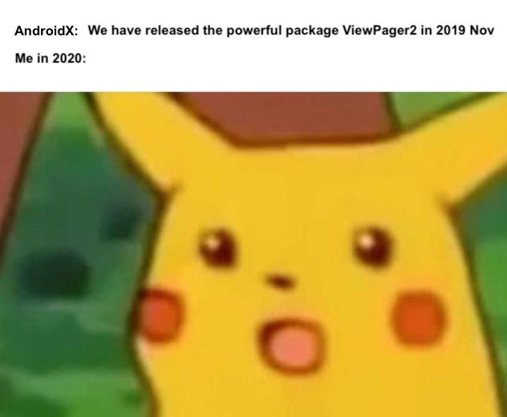

# AndroidViewPagerStudies

   
  2?

## How ViewPager2 changed our development
Although the sense of naming is quite..., It is still highly recommanded to treat `ViewPager2` as the replacement of `ViewPager`. 
 
`ViewPager2` is build based on RecyclerView which means it is almost a different system from `ViewPager`. For sure, devs are now required to implement `RecyclerView.Adapter` to use `ViewPager2`.

## Why ViewPager2 is so powerful
It is because the power of `RecyclerView`. It uses view holder pattern for pages, providing the ability of add/delete/move pages and its default nice animation. They are especially important when implementing dynamic pages like promotion banner viewer.

## Examples in this Repo

TBC..
